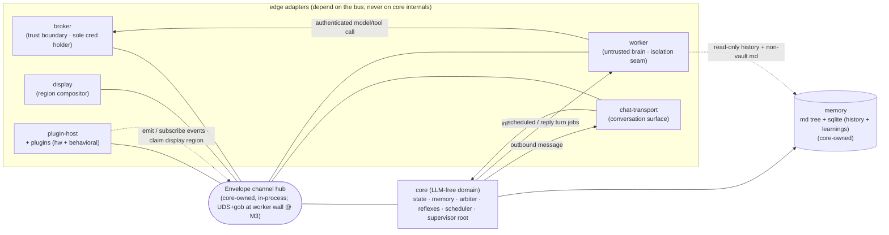
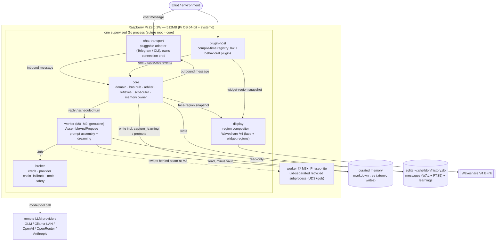

# Architecture Spine — shelldon (Go rewrite)

> A consistency contract, not a design document. It fixes the **invariants** that keep the features
> built below it coherent. Structure is **seed** — the code owns the detail once it exists.
> Decisions, not rationale (that lives in `.memlog.md`).

## Design Paradigm

**A single supervised Go process — a hexagonal LLM-free core with goroutine actors over an in-process typed channel bus, and the untrusted brain behind a swappable isolation seam.**

The Python v2 spine's *logical* hexagon survives the port and gets cleaner; its *physical* multi-process body (fork-server, UDS bus, separate broker/transport/display/plugin-host processes) collapses into **one supervised process**. Subsystems become **goroutine actors** under a `suture/v4` supervisor tree; the bus becomes a **core-owned channel hub** carrying the same `Envelope`/`Job`/`Result` contracts as Go values — no in-process serialization. `core` is the hexagon's **domain center** (LLM-free): it owns personality-state, memory, the arbiter, the resident reflexes, the scheduler (the autonomous mind, AD-13), and hosts the bus hub. Everything else is an **edge adapter** — the brain (worker), the trust boundary (broker), the conversation surface (chat-transport), the screen (display), the senses + behavioral plugins (plugin-host) — reaching the core *only* through the bus.

The **worker is the one untrusted-by-design component** (it assembles prompts from web-influenced content). It lives behind a **swappable isolation seam** (a Go interface): a goroutine in Monolith+ for M0–M2, a uid-separated subprocess in Privsep-lite from M3. The bus transport under the seam swaps with it (channel → UDS+gob) while the contracts stay invariant.

Namespace map: `core/` = domain (LLM-free, `depguard` + `internal/`-enforced; includes the scheduler) · `broker/` `worker/` `transport/` `display/` `plugins/` = adapters · `contracts/` = the shared `Envelope`/`Job`/`Result` types.

## Invariants & Rules



### AD-1 — Single supervised Go process; LLM-free core is the supervisor root `[ADOPTED]`
- **Binds:** all; `core/`
- **Prevents:** a builder assuming process-peer actors that don't exist at M0, or that the isolation seam is already a process wall; the brain's concerns leaking into the soul.
- **Rule:** one process. Edges are goroutine actors; `core` (bus hub, arbiter, reflexes, state, memory, scheduler) is the **supervisor root** and imports no LLM/provider modules — enforced by `depguard` (CI fails the build) and by putting provider SDKs behind `broker/internal/`. The isolation seam (AD-2) is a goroutine at M0–M2, a process wall at M3+; no code may assume it is already a wall. (Keystone Go decision; adapts Python AD-1, collapses Python's multi-process model into one process.)

### AD-2 — Worker isolation seam: the brain behind a swappable interface `[ADOPTED]`
- **Binds:** all; `worker/`, `contracts/`; `CAP-1`
- **Prevents:** the isolation strategy bleeding into every caller; the M3 hardening reshaping the system.
- **Rule:** the worker is a Go **interface** — `Worker.AssembleAndPropose(ctx, turn) (Result, error)`. Two implementations ship behind it: **Monolith+** (goroutine, `context` timeout + own `recover()`) for M0–M2, **Privsep-lite** (a long-lived uid-separated recycled subprocess, re-exec of `/proc/self/exe`, not fork) as the M3+ end-state. WASM/wazero is a deferred third implementation behind the same seam. ≤1 worker turn in flight regardless of implementation (AD-8). (Inherited from the brainstorming decision; adapts/collapses Python AD-3 fork-server.)

### AD-3 — Worker-isolation threat trigger: the vault never exists until the worker is across a process wall `[ADOPTED]`
- **Binds:** worker, broker, memory, milestones; `CAP-6`
- **Prevents:** a goroutine-worker in Monolith+ ever reading a populated vault — the interim exposure window never opens. A testable invariant, not a managed risk.
- **Rule:** no real secret reachable by prompt-assembly (the `vault/` promotion target, AD-9/AD-15) **EXISTS** until the worker is across a process/uid wall (Privsep-lite, AD-2). Vault population is gated on the worker being uid-separated; before M3 there is nothing for a goroutine-worker to read. At M3+, `vault/` permissions exclude the worker uid (OS-enforced, not a path-filter), and surfacing vault contents into a prompt is a broker-gated decision. (Adapts Python AD-6's vault-uid-exclusion to the Go staging.)

### AD-4 — Uniform Envelope contract; transport is a swappable seed `[ADOPTED]`
- **Binds:** all inter-component communication; `contracts/`
- **Prevents:** the M3 isolation swap reshaping any caller — it stays a pure transport change; ad-hoc point-to-point channels edges can't track.
- **Rule:** `Envelope`/`Job`/`Result` are uniform **Go structs** over a core-owned **in-process channel hub** — **NO in-process serialization**. The message **CONTRACTS** are binding invariants: the Job/Result proposal protocol, `turn_id` idempotent-close (AD-11), display-snapshot monotonic `seq` (AD-6), and the closed plugin event-kind set (AD-14). The **TRANSPORT** under the seam is swappable seed: channel now → UDS + `encoding/gob` at the worker wall at M3, reshaping no caller. The closed envelope header is `id/v/kind/src/dst/turn_id` with two routing modes (point-to-point by `kind`→destination table; broadcast/subscription over a closed event-kind set fanned out from plugin manifests). The closed set covers both **kind AND body**: each event kind is **co-versioned with a payload struct in `contracts/`** — subscribers decode the declared struct for that kind; no free-form/ad-hoc event bodies. (Adapts Python AD-4 Envelope-bus + AD-11 closed header + routing modes.)

### AD-5 — Crash-isolation: suture supervises every edge; the soul survives any single edge failure `[ADOPTED]`
- **Binds:** all subsystems
- **Prevents:** an unrecovered edge goroutine panic killing the whole pet (Go `recover()` does NOT cross goroutines).
- **Rule:** `suture/v4` supervises every edge (broker, transport, display, plugin-host, worker invocation) as a `Service` (`Serve(ctx) error`) with its own `defer recover()` + backoff restart; `core` is the supervisor root. **Invariant: the soul survives ANY single edge failure** — a dead edge degrades gracefully (transport down → reflex-only; provider chain exhausted → reflex fallback, AD-8; plugin crash → kills its widget, not the soul, AD-14). `systemd Restart=always` (+ `OOMPolicy=stop`) is the outer net; only `core` death restarts the process. Graceful shutdown via `signal.NotifyContext`, draining in reverse startup order. (New Go decision; carries Python AD-8/AD-13 degradation semantics.)

### AD-6 — Core is the sole writer of state and memory `[ADOPTED]`
- **Binds:** all; `CAP-2`, `CAP-6`
- **Prevents:** write races; an injected worker corrupting the soul or memory; divergent state.
- **Rule:** only `core` mutates personality-state, the markdown memory tree, and the sqlite store. Reflexes mutate state in-core. The worker **never** writes — a `Result` envelope carries *proposed* changes that core validates and applies; the worker reads history **read-only**. State deltas are **sparse patches over fixed dotted paths**; memory-ops have **fixed arg schemas in `contracts/`** (`remember`/`rewrite_about`/`log_episode`/`capture_learning`). Display never reads shared memory: **core pushes region snapshots** with a **monotonic `seq`**, display **renders latest-wins**, dropping stale frames. Display is a **compositor of REGIONS** — core owns the `face` region; plugins may **claim** widget regions (AD-14). Region ids are a **single closed enum type defined in `contracts/`** — the one source of truth; the compositor and every plugin compile against the same enum. Plugin manifests (AD-14) **reference** values of that closed type — they never mint region-id strings. Conflicting claims are rejected at startup, so no two writers ever target one region. (Adapts Python AD-5.)

### AD-7 — Hybrid memory: sqlite history+learnings + atomic markdown tree `[ADOPTED]`
- **Binds:** `CAP-6`
- **Prevents:** a memory contract core and worker could implement incompatibly; reliance on vectors (spec non-goal); SD-wear from high-churn writes.
- **Rule:** durable memory has **two layers, no vectors**:
  1. **Conversation history + learnings → `modernc.org/sqlite`** (pure-Go, `CGO_ENABLED=0`, **FTS5** compiled in), one file at `~/.shelldon/history.db`. Ordered timestamped **messages** (FTS5 keyword recall) + a **`learnings`** table (`pattern_key` dedup, `recurrence_count`, `status` pending/promoted/pruned, `observation`, timestamps). On a turn the worker may propose `capture_learning(observation, pattern_key?)` (hot path, no extra LLM); core (single writer, AD-6) inserts or increments `recurrence_count` at `status=pending`. On a `pattern_key` match, because core is the **single writer** (AD-6) it applies proposals **serially** — no row race: core increments `recurrence_count`, refreshes `observation` to the latest proposed value, and resets `status=pending`. Concurrent `capture_learning` proposals (e.g. a reflection turn and a dream turn) are **serialized through core**, never applied concurrently. Schema shaped so an owner/`chat_id`/`user_id` key is a non-breaking add (AD-12). **WAL** mode + `synchronous=NORMAL` + batched commits bound write frequency.
  2. **Curated knowledge → markdown tree** (`about.md` rewritable, `INDEX.md`, `facts/`, category folders, `vault/`). Every write is **atomic** via `google/renameio/v2` (temp + rename), which provides **atomicity**; for power-loss **durability** an explicit **parent-directory fsync** follows the rename (atomicity alone satisfies the M0 crash-safety test, AD-10; the dir-fsync is the durability add). `about.md` and the curated tree are **bot-owned** (core is sole writer; the LLM self-rewrites via memory-ops).
  3. **Owner directive → `DIRECTIVE.md`** (human sole writer, the owner-controlled "constitution"): injected into every prompt as authoritative, never a memory-op target, never under core's write path. Disjoint writer sets keep single-writer intact.
  Retrieval = `DIRECTIVE.md` (first) + `about.md` + recent window (from sqlite) + LLM `grep` over non-vault markdown / FTS5 over history. The worker reads history read-only and the markdown tree minus `vault/`. The **dream cycle** (AD-15) promotes durable `pending` learnings into curated markdown (sensitive → `vault/`, broker-gated) and prunes the rest. Division: **sqlite = raw + queryable; markdown = curated + durable**. (Adapts Python AD-6.)

### AD-8 — The arbiter governs the brain: ≤1 turn, coalesce, cost/battery-gated `[ADOPTED]`
- **Binds:** `CAP-1`, `CAP-2`, `CAP-4`, `CAP-8`; `core/`
- **Prevents:** concurrent worker invocations blowing RAM; a poke-stampede of queued turns; uncontrolled proactive spend; a failed call freezing the pet.
- **Rule:** a single arbiter in core decides reflex-vs-turn and governs turns: **≤1 worker turn in flight**; events during a turn **coalesce into a single pending catch-up slot** (never a growing backlog) — the slot is **per turn-job CLASS** (reply / proactive-ping / dream): coalescing collapses same-class events, and a queued job of one class **never silently evicts** a different class (the arbiter holds at most one pending **per class**, still honoring ≤1-in-flight + the budget/battery gate when admitting); proactive turns (CAP-4) are gated by a **minimum-interval cooldown**; on provider-chain exhaustion the arbiter **falls back to a reflex behavior** so the pet never freezes (`context` cancellation kills the in-flight turn). All turn-jobs (proactive pings + dreaming, AD-15) carry a **cost** and are gated by a **daily credit/turn BUDGET** and **PiSugar2 battery-aware backoff** (read via the scheduler, AD-13): skip/defer non-essential LLM turns on battery/low charge, livelier when plugged in. The ≤1-worker bound is a **required M0 test** (AD-10). (Adapts Python AD-9.)

### AD-9 — Broker is the sole trust boundary: sole cred holder + model/tool egress `[ADOPTED]`
- **Binds:** all; `CAP-5`, `CAP-8`
- **Prevents:** two owners of credentials; a prompt-injected worker reaching secrets or making arbitrary external calls.
- **Rule:** the broker is the **only** holder of MODEL + TOOL credentials + safety policy and the **only** egress to models/tools. It owns the ordered **provider chain with retry/fallback** (default GLM via base-URL swap; alternates Ollama-LAN/OpenAI/OpenRouter/Anthropic), composed with **`failsafe-go`** (retry + breaker + timeout + fallback). Idiom: broker exposes only a pre-authorized `*http.Client` (an `http.RoundTripper` that injects auth); downstream code never sees the raw key. A **`depguard` rule enforces that only `broker/internal/` may import provider/LLM SDKs** — build-failing, not just idiom (mirrors AD-1). `Job` envelopes carry **no creds**; the broker injects them internally — **no credentials ever on the bus**. **Scope:** this governs model/tool creds + egress; a chat-transport adapter owns its **own** connection credential for its own surface (AD-12) and never touches model/tool creds. From M3 the worker reaches the broker only across the process wall (AD-2/AD-3). (Adapts Python AD-2.)

### AD-10 — Versioned typed contracts + tests from M0 `[ADOPTED]`
- **Binds:** all; `contracts/`, `tests/`
- **Prevents:** the Python v1's zero-test drift; silent contract breaks across the bus.
- **Rule:** `Envelope`/`Job`/`Result` are **versioned** Go structs in `contracts/` (`v` header field + additive fields); Go structs *are* the typed contract at compile time. A test harness exists from M0; **required M0 tests:** contract round-trip — an explicit **`gob` encode/decode round-trip of every `Envelope`** (so M3's UDS+gob transport swap can't surface a gob-incompatibility later), the **≤1-worker-in-flight** bound (AD-8), **atomic-write crash-safety** (a write interrupted mid-`rename` leaves the prior tree intact, AD-7), and **"the soul survives a single edge panic"** — inject a panic in one edge `Service` and assert `core` + the other edges keep running (validates AD-5, since `recover()` doesn't cross goroutines). M0 is a **real walking skeleton** end-to-end through the real hub, building `CGO_ENABLED=0` and passing **on the Pi**, not the laptop. Use `testing/synctest` for deterministic scheduler-cadence tests; narrow interfaces over every external seam (SPI/GPIO/LLM/clock) wired by constructor injection (no monkeypatch in Go). (Adapts Python AD-10.)

### AD-11 — Turn identity & idempotent close `[ADOPTED]`
- **Binds:** `core/`, `worker/`; `CAP-1`, `CAP-8`
- **Prevents:** a late or zombie `Result` from a dead/superseded worker racing the reflex fallback or polluting the next turn.
- **Rule:** every turn carries a `turn_id` (a field of the closed `Envelope` header, AD-4); core **fences** on it. A `Result` whose `turn_id` is already closed (timed out, superseded, fallback-resolved) is **discarded**. Turn close is **idempotent**. `turn_id` fencing is implemented via `context` cancellation. (Adapts Python AD-12.)

### AD-12 — Chat transport is a pluggable first-class adapter `[ADOPTED]`
- **Binds:** `CAP-1`; `transport/`, `contracts/`
- **Prevents:** hardcoding one transport; the conversation surface diverging per backend; a transport reaching into core internals or holding model/tool creds; a crash of the primary surface taking down the pet.
- **Rule:** the chat transport is a **first-class edge actor / bus client** (peer to broker and display) — it emits **inbound-message** envelopes and consumes **outbound-message** envelopes, speaking a **transport-agnostic message contract in `contracts/`** (a Go interface; never leak `telego.Update` into core). **One adapter ships now** (Telegram via `mymmrac/telego`, or local CLI); more (group/web/multi-user) are added as adapters **without core change**. The adapter holds its **own** connection credential; the broker remains sole holder of model/tool creds (AD-9 scope). **Core owns the conversation-identity schema** (the `owner` identity + the `chat_id`/`user_id` columns, cross-ref AD-7); each transport adapter **maps its native id into that schema at the edge** — adapter-native ids (e.g. Telegram chat id types) never leak past the transport boundary into core or sqlite. Single owner = core; `chat_id`/`user_id` is the non-breaking column core adds (AD-7). The adapter is **supervised + auto-restarted** (AD-5); a transport failure **degrades to reflex-only** and never crashes core. Telegram long-poll specifics (NAT-idle watchdog, `Timeout` under the NAT window) are adapter detail. (Adapts Python AD-13.)

### AD-13 — Scheduler: the autonomous mind (multi-cadence, cost-tiered, battery-aware) `[ADOPTED]`
- **Binds:** `CAP-10`; `core/`
- **Prevents:** the Python v1's single-tick coarseness; unbounded background CPU/LLM/battery spend from a self-waking mind.
- **Rule:** a **core-resident scheduler** owns the pet's self-driven life as **named jobs**, each with its own **cadence** (`interval`, `cron`-style, or `idle-triggered`) — "heartbeat" is now just one job. Each job is tagged by **COST TIER**: **reflex jobs** (mood drift, blink) run **in-core, no LLM, cheap CPU**; **turn jobs** (reflection, dreaming AD-15, proactive pings) each cost a worker invocation + LLM, are few, cooldown-gated, and draw on the daily credit/turn BUDGET (AD-8). **Battery-aware:** reads PiSugar2 power state, stretches cadences / skips non-essential LLM turns on battery, livelier when plugged in. **Incoming messages/events bypass the scheduler** (immediate). Scheduler-proposed turn jobs go through the **arbiter** (AD-8) — same ≤1-worker bound, coalescing, and gate; the scheduler never invokes the worker directly. (Adapts Python AD-14.)

### AD-14 — One compile-time bus-only plugin registry (hardware + behavioral) `[ADOPTED]`
- **Binds:** `CAP-3`, `CAP-7`; `plugins/`, `contracts/`
- **Prevents:** dynamic-load fragility (Go has no clean dynamic plugin loading) + multi-runtime RAM cost on 512MB; a second divergent plugin class for behaviors; a plugin reaching into core.
- **Rule:** **one plugin contract** covers BOTH hardware plugins (sensors/actuators) AND behavioral plugins (e.g. an XP/leveling widget) — no separate behavioral class. Plugins are **Go packages registered explicitly at compile time** in `main` (a **compile-time registry**); "add a plugin" = recompile + redeploy, keeping the **single static binary** (`CGO_ENABLED=0`, gokrazy-friendly), zero process sprawl. The **manifest is a Go struct** declaring everything claimed — emitted event kinds, subscribed broadcast event kinds (`message-answered`, `tool-used`, `day-alive`, …), GPIO/BLE resources, display regions (**referencing** values of the closed region-id enum in `contracts/`, AD-6 — never minting region-id strings) — and **conflicting claims are rejected at STARTUP** (one writer per GPIO pin, one per display region). A plugin may emit/subscribe event envelopes, own **private state** (never core's soul/memory), and claim a display region; it is a bus client speaking only `Envelope` and **never imports core**. BLE is **pair-first** (no promiscuous scanning). Escape hatch: a subprocess plugin-host can be added later via the same Envelope contract, no contract redo. (Re-decides Python AD-8, which doesn't port — dynamic loading replaced by a compile-time registry.)

### AD-15 — Dreaming & learning consolidation `[ADOPTED]`
- **Binds:** `CAP-6`, `CAP-11`
- **Prevents:** unbounded memory growth; learnings sitting in sqlite forever; a separate non-reusing "consolidation subsystem" duplicating the worker/broker/arbiter machinery.
- **Rule:** **dreaming is a scheduled introspective WORKER TURN** (triggered by idle / context-pressure / cadence, AD-13) — not a separate subsystem: it **reuses the worker (via the AD-2 seam), broker, and arbiter** exactly like a normal turn. In one dream turn the worker (1) **consolidates** recent history (summarize/compact the window), (2) **classifies** `pending` `learnings` (AD-7) and **promotes** durable/high-value ones by impact + recurrence into curated markdown (`about.md`/`facts/`), routing sensitive ones to `vault/` (broker-gated, AD-9; only once the worker is across the process wall, AD-3), and (3) **prunes** the rest. The worker only **proposes** memory-ops; **core is the single writer** (AD-6). **LIGHT scope:** no ERRORS/FEATURE_REQUESTS taxonomy, no skill promotion, no copy of v1's machinery. (Adapts Python AD-15.)

### AD-16 — Volatile state in RAM, checkpointed `[ADOPTED]`
- **Binds:** `CAP-2`, `CAP-6`
- **Prevents:** high-frequency reflex/state churn (mood-drift, blink — AD-13) wearing the SD card.
- **Rule:** the personality-state struct and the working window (recent-turn window + running summary) live in **RAM**, checkpointed periodically to **one small file**; the durable layers remain markdown (curated) + sqlite (history) per AD-7. RAM state is **never the source of truth** for either durable layer. (Adapts Python AD-7.)

### AD-17 — Observability & operational logging `[ADOPTED]`
- **Binds:** all; operational envelope
- **Prevents:** an unattended, battery-yanked device failing silently with no diagnosable trail.
- **Rule:** structured logging via stdlib **`log/slog`** to stdout/stderr → **journald** (systemd `Type=simple`); slog attributes become queryable journal fields. journald configured `Storage=persistent` with `SystemMaxUse` caps to bound SD-card write wear. Subsystem panics, edge restarts (suture `EventServicePanic`/`EventBackoff`), turn lifecycle, and provider-chain fallbacks are logged events. (New Go decision; operational envelope.)

## Consistency Conventions

| Concern | Convention |
| --- | --- |
| Naming | Edge actors are goroutines (M3: the worker becomes a subprocess) named for their role (`core`/`broker`/`worker`/`chat-transport`/`display`/`plugin-host`); envelope types are `Envelope`/`Job`/`Result` plus the transport-agnostic inbound/outbound message contract; memory-ops are verbs (`remember`, `rewrite_about`, `log_episode`, `capture_learning`); scheduler jobs are named (`heartbeat`, `mood-drift`, `dream`, …); the worker seam is the `Worker` interface (`AssembleAndPropose`). |
| Plugins & claims | One plugin contract for hardware AND behavioral plugins (AD-14); registered at compile time in `main`; a Go-struct manifest declares all claims — GPIO/BLE pins, display regions (AD-6), emitted + subscribed event kinds; conflicting claims rejected at **startup** (one writer per GPIO pin, one per display region); plugins own private state, never import core, speak only `Envelope`. |
| Ownership transfer | Values sent over the in-process channel bus are **transfer-of-ownership**: the sender does not retain or mutate aliases after sending; core **copies on apply** where it must retain. Keeps single-writer (AD-6) real despite the shared address space. |
| Data & formats | Go structs over channels in-process (no serialization); at the worker wall (M3) UDS frames are length-prefixed `encoding/gob`; closed envelope header `id/v/kind/src/dst/turn_id` (AD-4/AD-11); state deltas are sparse patches over fixed dotted paths; snapshots carry monotonic `seq`; timestamps ISO-8601 UTC; **no credentials ever on the bus**. |
| State & cross-cutting | One writer (core) for state + memory incl. sqlite (history + `learnings`; worker reads read-only); atomic markdown writes via `renameio/v2`; sqlite WAL + batched commits; `vault/` doesn't exist until the worker is uid-separated (AD-3), then OS-unreadable to the worker uid; errors surface as a `Result` error variant (never a panic across the bus); a turn failure degrades to reflex, never blocks; turns fenced by `turn_id` with idempotent close + `context` cancellation (AD-11); config + secrets resolve only inside the broker; every external seam (SPI/GPIO/LLM/clock) is a narrow interface injected at `main` (no monkeypatch). |
| Supervision | Every edge is a `suture/v4` `Service` (`Serve(ctx) error`) with its own `defer recover()` + backoff; core is the supervisor root; `systemd Restart=always` + `OOMPolicy=stop` is the outer net; graceful shutdown via `signal.NotifyContext` draining in reverse start order. |
| Cost & cadence | The scheduler (AD-13) runs named multi-cadence jobs tagged by cost tier — reflex jobs in-core/no-LLM; turn jobs (incl. dreaming + proactive) cost a worker invocation + LLM, gated by a daily credit/turn budget + PiSugar2 battery-aware backoff (AD-8); incoming messages/events bypass the scheduler (immediate). |

## Stack

| Name | Version |
| --- | --- |
| Go (`CGO_ENABLED=0`, `GOARCH=arm64`) | 1.25+ |
| modernc.org/sqlite (pure-Go, FTS5) | latest |
| periph.io/x/host/v3 + warthog618/go-gpiocdev | latest |
| google/renameio/v2 | latest |
| thejerf/suture/v4 | latest |
| failsafe-go | latest |
| anthropics/anthropic-sdk-go | latest |
| sashabaranov/go-openai (GLM / OpenAI / OpenRouter via base-URL swap) | latest |
| ollama/ollama/api | latest |
| mymmrac/telego | latest |
| depguard (via golangci-lint) | latest |
| Platform: Raspberry Pi OS 64-bit + systemd | (gokrazy deferred) |

Build: `GOOS=linux GOARCH=arm64 CGO_ENABLED=0 go build -ldflags="-s -w"`. Tuning (runtime, not invariant): `GOMEMLIMIT≈280MiB`, `GOGC=50`; do **not** set `GOARM64=v8.0,lse` (Cortex-A53 lacks LSE atomics).

## Structural Seed



```text
shelldon_go/
  core/          # LLM-free (depguard + internal/ enforced): bus/ arbiter/ scheduler/ reflexes/ state/ memory/(owner) — suture root
  broker/        # creds, provider chain+fallback, tool exec, safety; broker/internal/llm/ holds provider SDKs
  worker/        # Worker interface (AssembleAndPropose): Monolith+ (goroutine) now, Privsep-lite (subprocess) @ M3; normal + dream turns
  transport/     # chat-transport adapters (Telegram / CLI); bus clients, own connection cred (AD-12)
  display/       # region compositor — Waveshare V4 (periph.io); core owns face region, plugins claim widgets (AD-6)
  plugins/       # plugin-host + plugins; compile-time registry (one contract, hw + behavioral; each plugin: Go-struct manifest)
  contracts/     # versioned Go Envelope/Job/Result + transport-agnostic message contract (gob at the worker wall)
  tests/         # harness from M0: contract round-trip, ≤1-worker, atomic-write crash-safety; synctest for cadences
  # runtime memory lives OUTSIDE source at ~/.shelldon:
  #   curated md tree  ~/.shelldon/memory/about.md INDEX.md DIRECTIVE.md facts/ vault/   (vault/ only populated once worker is uid-separated, AD-3)
  #   sqlite store     ~/.shelldon/history.db   (messages: WAL + FTS5; learnings: pattern_key/recurrence_count/status; single-owner now)
```

**Component-local deps (resolved at install against real hardware, not spine invariants):** Waveshare V4 E-Ink (`periph.io/x/devices/v3/epd`, no CGo) + SPI in `display/`; PiSugar2 power/button over its local HTTP/socket API in `plugins/` (power state also read by the scheduler, AD-13); per-provider LLM SDKs inside `broker/internal/` (default GLM via base-URL swap). systemd unit: `MemoryHigh=180M` < `MemoryMax=220M`, `OOMPolicy=stop`, `Restart=always`; do **not** set `PrivateDevices=true` (breaks `/dev/spidev`, `/dev/gpiochip`, `/dev/i2c`). Dev/deploy loop: cross-compile on the laptop (never on the Pi), `rsync` the binary with an atomic swap, `systemctl restart`; `watchexec`/Taskfile drives the loop.

## Capability → Architecture Map

| Capability | Lives in | Governed by |
| --- | --- | --- |
| CAP-1 LLM response to interaction | chat-transport ↔ core; arbiter → worker (seam) → broker | AD-12, AD-2, AD-9, AD-8, AD-4, AD-11 |
| CAP-2 Aliveness / resident reflexes | core reflexes + personality-state | AD-1, AD-6, AD-8 |
| CAP-3 Physical sensing (optional plugins) | plugin-host plugins (button, BLE) | AD-14 |
| CAP-4 Proactive action | arbiter (cooldown + credit/battery-gated); scheduler proposes | AD-8, AD-13 |
| CAP-5 Single capability broker | broker (in-process; worker reaches it across the wall @ M3) | AD-9, AD-4 |
| CAP-6 Cross-turn memory | core-owned hybrid: sqlite (history + learnings) + markdown tree | AD-6, AD-7, AD-15, AD-3 |
| CAP-7 Pluggable plugins (hardware + behavioral) | plugin-host + one compile-time bus-only contract | AD-14, AD-6 |
| CAP-8 LLM fallback on error | broker provider chain (`failsafe-go`) + arbiter degradation | AD-9, AD-8 |
| CAP-9 Display compositor (face + widget regions) | display region compositor; core owns face, plugins claim widgets | AD-6, AD-14 |
| CAP-10 Autonomous mind / scheduling | core scheduler — named multi-cadence jobs, cost-tiered, battery/credit-aware | AD-13, AD-8 |
| CAP-11 Self-improving learning + dreaming | hot-path `capture_learning` → sqlite; dream turn classifies/promotes/prunes | AD-15, AD-7 |

## Deferred

- **Privsep-lite activation (M3+).** The worker stays a goroutine (Monolith+) through M0–M2; the uid-separated subprocess + UDS+gob transport + vault population turn on at M3 behind the unchanged `Worker` seam (AD-2/AD-3/AD-4).
- **Threat-model confirmation before M3.** The "worker is untrusted" basis of AD-3 is settled in principle; an explicit confirmation + a vault-isolation property test is the M3 gate, not an M0 one.
- **WASM/wazero worker.** A third `Worker` implementation behind the same seam (AD-2), deferred — evaluate only if Privsep-lite proves insufficient.
- **gokrazy deployment.** Pi OS + systemd ships M0–M4; gokrazy (read-only root, A/B OTA, power-loss resilience) is worth a look once hardware works — it forces Go PiSugar2 drivers + polling (no GPIO edge interrupts), so not on the M0 critical path.
- **Additional transport adapters** (group chat, web, multi-user keying) — architected, not implemented; new `transport/` adapters + a non-breaking `chat_id`/`user_id` add, no core change (AD-12).
- **Multi-pet / multi-user.** Schema shaped for it (AD-7); single-owner now.
- **Heap-fragmentation guard.** Go's non-moving GC may pin pages; `sync.Pool` for per-turn buffers + an RSS-flat-across-50-turns check confirms the goroutine-worker is sufficient before assuming a problem (also the AD-2 Monolith+ validation).
- **Reflex / scheduler job catalogue, credit-budget number, battery thresholds, BLE pairing UX** — story-time / runtime config, not spine invariants (AD-13/AD-8).
- **Learning-promotion heuristics** (impact + recurrence judgment) — runtime detail of the dream turn (AD-15).
- **Exact LLM model id + per-provider config** — broker config (default GLM via base-URL swap), not spine.
- **Sound-out / always-on audio** — spec non-goals.
